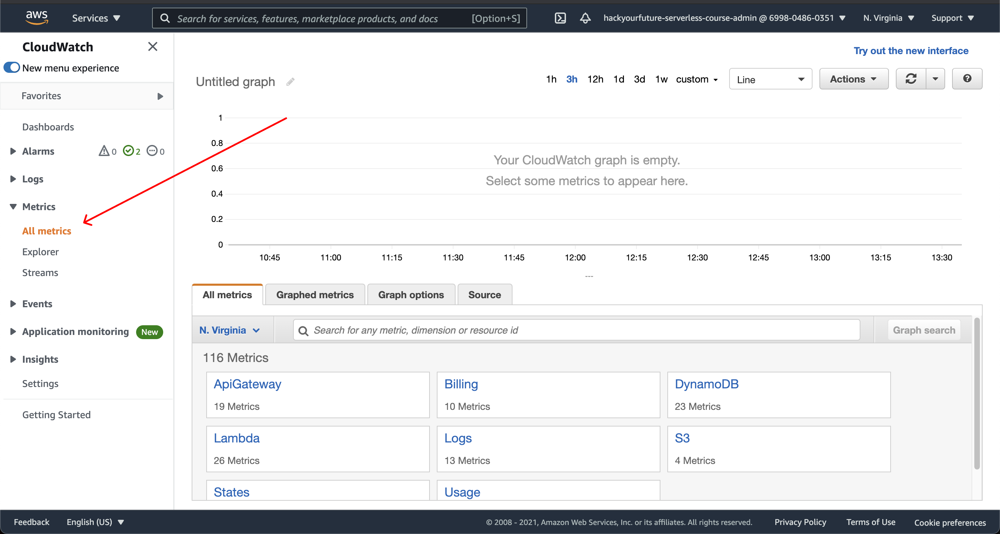
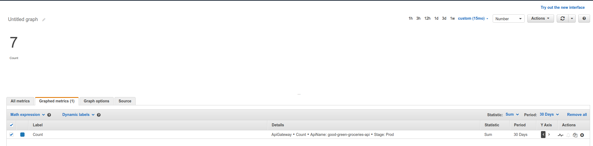
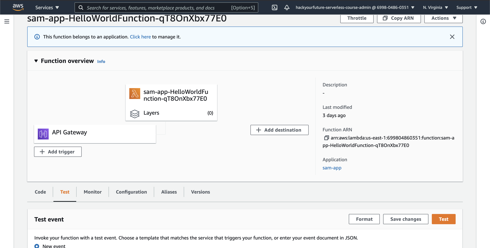

# Homework

## How to deliver homework

Open this template repository https://github.com/HackYourFuture-CPH/masterclass-hyf-homework and click on  and then create a copy of this structure on your own GitHub profile with the name `masterclass-hyf-HYF-homework`

Create a PR to add your homework to the respective week folder like you are used to do in the web development course, and if you don't remember how to do hand in homework using Pull Requests, please check here https://github.com/HackYourFuture-CPH/JavaScript/blob/master/javascript1/week1/homework.md

## Homework exercises for Week #3

This weeks builds on top of your previous exercises, namely your new found web application for GoodGreenGroceries food box subscriptions. The Sales team of Good Green Groceries are eager to find out how much traffic the newly launched website is recieving. They are very concerned about the scalability of this "S3 hosting" you have recommended, and we will therefore give them the daily numbers of the traffic recieved on our website to ease their mind.

We do this by extending our application with a simple cron task - executed on a lambda.

To recap from class, two things is needed to create and deploy:

1. A zipped collection of your application files - i.e the files runned when the lambda executes
2. A cloudformation template describing the lambda infrastructure - e.g the runtime, when to execute and other configuration.

(note: The `SAM CLI` helps us zip our code and interface with the AWS service cloudformation)

To begin with, we have been handed over a broken lambda and will need to fix it ourselves. Once we have fixed it, we will then add functionality for telling us how many visitors we have on our website through AWS Cloudwatch (we will go over cloudwatch in Part II).

## Part I:

1. Navigate into `materials/homework-cron-lambda`, where you will find three files.

```
- scheduled-event-logger.js
- package.json
- template.yml
```

Someone has been commenting out lines by accident, making our lambda broken. Remove all comments across the files, and note down the values which was broken in our `assignments.md` found [here](https://github.com/HackYourFuture-CPH/hyf-serverless-course/blob/main/week3/materials/homework-cron-lambda/assignments.md]).

2. What is the `type` value of our lambda in cloudformation (hint: it starts with `AWS::`). Link the documentation and full value for it.
3. Now with the template fixed, we can run our lambda. Still being at `materials/homework-cron-lambda` you can run the lamda locally with `sam local invoke`. Write down the rubbish string it currently produces, and then, make it return then **sane** string.
4. We will need to output the amount of requests going through our backend. This is done through a useful service called [cloudwatch](https://aws.amazon.com/cloudwatch/). Navigate into the [AWS console](https://console.aws.amazon.com) and find the cloudwatch service. Here, go to all metrics, and find the namespace called `ApiGateway`, then `By Stage`. Plot the latency and take a screenshot (you will need to upload the image as part of your PR) for the api called **good-green-groceries-api**.



5. Next, we want to know the request `Count`. What is the total count value for the last 12 months (see screenshot if you are stuck on how to get number visualized correctly)



## Part II

Now that we know are a bit more familiar with cloudwatch and running lambdas locally, we will automate the process of figuring out the daily counts inside of our lambda!

1. First, install the AWS SDK Cloudwatch sdk to our lambda with the following command:

`npm install @aws-sdk/client-cloudwatch`

Next, uncomment all the code related to the cloudwatch client inside the lambda.

3. We will now need to change the relevant parameters for the cloudwatch call. Figure out which values is correct for retrieving the count you found in Part I (docs can be found [here](https://docs.aws.amazon.com/apigateway/latest/developerguide/api-gateway-metrics-and-dimensions.html)).

4. The sales department of Good Green Groceries wants even more metrics! Enhance your lambda to return all metrics with the `ListMetricsCommand` for our API Gateway (see examples [here](https://docs.aws.amazon.com/sdk-for-javascript/v3/developer-guide/cloudwatch-examples-getting-metrics.html)). Make the lambda only output all avaliable names of the metrics in the following structure:

```
{
   "command": "API_ANALYZER",
   "values": ["Latency", "4XX", ...],
   "date": "2021-20-01
}
```

5. We now need to deploy, validate and trigger our lambda. To deploy we can use the `sam deploy --guided` command. Theese arguments will need to be as follows (feel free to choose the others yourself):

   1. Type 'hyf'-{your-credentials}-homework-cron-lambda' as the stack name, e.g `hyf-pds-cron-homework-lambda`.
   2. Choose default region (us-east-1)
   3. Confirm IAM role creation

Finally, navigate into the lambda UI - there are quite a few tabs, but the one we are looking to use is called **test**. You can trigger the code from here by creating a test event and then trigger it with that particular event. Take a screenshot of the success message and upload it as part of your PR.



6. The sales team is once again being annoying, and believe that your lambda is not working all the time. They need to be shown some kind of **monitoring** graph indicating that the lambda is indeed running successfully. Take a screenshot of this visual and upload it as part of your PR. You can do it through the lambda console UI or cloudwatch UI.
